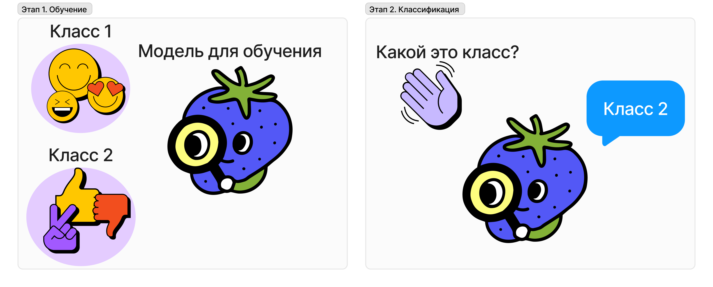

# Машинное обучение для чайников

Машинное обучение может показаться черным ящиком, но на самом деле оно построено на простых и понятных принципах. В этом статье я разберу схему обучения моделей и немного математики, которая за ней стоит. В последнем разделе вы сможете исследовать машинное обучение на реальных примерах с кодом.

+ [Что такое Supervised Learning?](#что-такое-supervised-learning)
+ [Математическая магия](#математические-основы)
+ [Реализация в коде](#реализация-в-коде)

## Что такое Supervised Learning?

Представьте, что вы пытаетесь научить ребенка распознавать виды животных. Вы показываете ему изображения собак, кошек и птиц и подписываете каждую картинку правильным названием животного. В этом суть Supervised Learning.

В Supervised learning "учитель" показывает модели смайлики с лицом и смайлики с рукой. Модель учится на этих данных и позже самостоятельно определяет, является ли смайлик рукой или лицом.

## Математическая магия

На первос этапе, на котором происходит обучения модели, модель с помощью какой-то математической магии составляет правило классификации. Этот этап для большинства людей, да и для меня тоже, является некоторой математической магией. Поэтому я хочу разобрать его на двух довольно простых математических моделях. Хотелось бы подчеркнуть **простых**, потому что нейросети появились сильно позже и к простым моделям не относятся.

А самое главное, нейросети и не в каждой задаче нужны. Например, с задачей определения спама в письмах отлично справится и Наивный байесовский классификатор.

### Линейный дискриминантный анализ

Представьте, что у вас есть красные, синие и фиолетовые стеклянные шарики. Ваша цель — разделить их на три кучки: красную, синюю и фиолетовую.

Линейный дискриминантный анализ (LDA) подобен рисованию на полу линии, разделяющей шарики.

Вот как LDA это делает:

1. Он смотрит на характеристики шариков и распределяет шарики по характеристикам на графике.

    

2. На основе этих характеристик он находит лучшую линию для разделения шариков. Эта линия нарисована таким образом, чтобы красные шарики находились на одной стороне, а синие шарики — на другой.

    

3. Как только линия нарисована, она может классифицировать новые шарики. Если новый шарик упадет на одну сторону линии, LDA предскажет, что он красный. Если он упадет на другую сторону, LDA предскажет, что он будет синим.

### Наивный байесовский классификатор

Представьте, что вы пытаетесь выяснить, является ли письмо спамом. Читаете письмо и видите:

* Есть слова «бесплатно» и «деньги».
* Активно просят перейти по ссылке.

Наивный байесовский классификатор использует эти подсказки для определения вероятности того, что это письмо спам. 

!Наивный же он, потому что предполагает, что подсказки независимы друг от друга.

По результатам обучения классификатор строит два графика вероятности для первого класса (письмо -- спам) и второго класса (письмо не спам). Можно заметить, что при критерии, например, наличие предлога `x=0` самая высокая плотность вероятности. 

Черным выделены области, которые относятся ко второму классу. То есть при наличии критерия, например, есть слово «деньги», `x=-2` письмо будет спамом.

## Реализация в коде