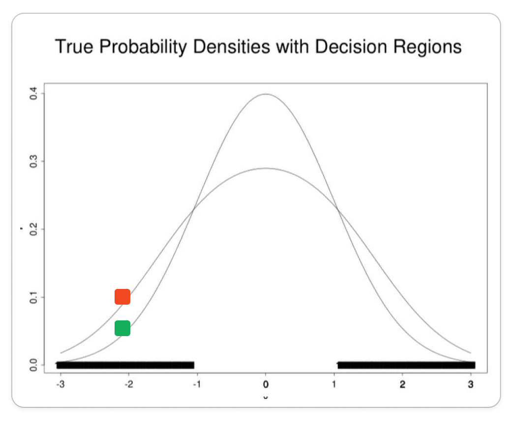

# Машинное обучение для чайников

Машинное обучение может показаться сложной областью, но его основные принципы просты. Эта статья познакомит вас с основами машинного обучения, ясно и доступно объяснив его концепции.

Мы погрузимся в машинное обучение с помощью:

1. Разбора основной парадигмы обучения -- обучение с учителем (Supervised Learning).
2. Рассмотрения математической основы машинного обучения на двух моделях: линейный дискриминантный анализ (LDA) и наивный байесовский классификатор.
3. Примера кода на библиотеке scikit-learn, позволяющей реализовать обсуждаемые модели.

## Что такое Supervised Learning?

Представьте, что вы пытаетесь научить ребенка распознавать виды животных. Вы показываете ему изображения собак, кошек и птиц и подписываете каждую картинку правильным названием животного. В этом суть обучение с учителем (Supervised Learning).

Только в машинном обучении вместо ребенка "учитель" обучает математическую модель. Например, "учитель" показывает смайлик и говорит, что этот смайлик с лицом относится к классу 1. Смайлики с руками относятся к классу 2.

Математическая модель после нескольких повторений начинает различать класс 1 и класс 2. После обучения модель определяет класс самостоятельно.


Такой тип обучения часто используют в задачах классификации на группы.

## Математическая магия

На этапе обучения модель с помощью математики составляет правило классификации. Этот этап для большинства людей, да и для меня тоже, является некоторой магией. Поэтому я разберу его на двух простых математических моделях: линейный дискриминантный анализ (LDA) и наивный байесовский классификатор.

Нейросети довольно сложная модель для таких разборов. А самое главное, простые классификаторы иногда даже лучше справляются с задачами. Например, с задачей определения спама в письмах отлично справится и наивный байесовский классификатор.

### Линейный дискриминантный анализ

Представьте, что у вас есть красные, синие и фиолетовые стеклянные шарики. Ваша цель — разделить их на три кучки: красную, синюю и фиолетовую.

Линейный дискриминантный анализ (LDA) подобен рисованию на полу линии, разделяющей шарики. Чтобы разделить шарики:

1. Он смотрит на характеристики шариков и распределяет шарики по характеристикам на графике.

    

2. На основе этих характеристик он находит лучшую линию для разделения шариков. Эта линия нарисована таким образом, чтобы красные шарики находились на одной стороне, а синие шарики — на другой.

    

3. Как только линия нарисована, она может классифицировать новые шарики. Если новый шарик упадет на одну сторону линии, LDA предскажет, что он красный. Если он упадет на другую сторону, LDA предскажет, что он будет синим.

### Наивный байесовский классификатор

Представьте, что вы пытаетесь выяснить, является ли письмо спамом. Читаете письмо и видите:

* Есть слова «бесплатно» и «деньги».
* Активно просят перейти по ссылке.

Для вас скорее всего это уже будет подозрительно. Наивный байесовский классификатор же во время обучения выделит из текста письма слова, который указывают на спам, и будет их использовать для определения спама.

> [!NOTE]  
> Классификатор наивный, потому что предполагает, что критерии спама независимы друг от друга.

Для определения спама наивный байесовский классификатор посчитает самые часто встречающиеся слова в обоих классах и построит два графика:
* график зависимости вероятности встретить слово от слова для первого класса: письмо -- спам.
* график зависимости вероятности встретить слово от слова для второго класса: письмо не спам.

Черным выделены области, где вероятность одного графика начинает превышать вероятность другого графика. То есть слова из выделенной области наиболее вероятно будут означать, что письмо -- спам.



## Реализация в коде

Для примеров с кодом я возьму [библиотеку scikit-learn](https://scikit-learn.org/stable/index.html). Она содержит не только все основные реализации моделей для обучения, но и примеры их использования, и всю нужную теорию. Большую часть информации для статьи я взяла там.

### Пример реализации линейного дискриминантного анализа (LDA)

#### Шаг 1. Ипорт библиотек и загрузка датасета

Среди библиотек помимо scikit-learn понадобятся numpy, pandas, matplotlib. Скачайте их, если они еще не установлены.

В коде ниже после импорта идет загрузка готового датасета от scikit-learn. На нем будет проще всего разобрать линейный дискриминантный анализ (LDA).

Датасет состоит из длины и ширины лепестка и чашелистика, в последней колонке указано класс ириса (0, 1 или 2):


Импортируйте библиотеки и загрузите датасет:

```python
# необходимый импорт
import numpy as np
import pandas as pd
import matplotlib.pyplot as plt
from sklearn.datasets import load_iris
from sklearn.preprocessing import StandardScaler, LabelEncoder
from sklearn.model_selection import train_test_split
from sklearn.discriminant_analysis import LinearDiscriminantAnalysis
from sklearn.ensemble import RandomForestClassifier
from sklearn.metrics import accuracy_score, confusion_matrix

# Загрузите датасет
iris = load_iris()
dataset = pd.DataFrame(columns=iris.feature_names,
                       data=iris.data)
dataset['target'] = iris.target
```

#### Шаг 2. Разбейте датасет на тренировочный и тестовый

Важно, не забыть об этом шаге. Иначае не будет тестовых данных для проверки модели. Обычно разбивают в соотношении 80% на тренировочный набор, 20% на тестовый.

Разбейте датасет:

```python
# Разделите набор данных на характеристики класса и указанный класс
X = dataset.iloc[:, 0:4].values # характеристики
y = dataset.iloc[:, 4].values # класс

# Подготовьте набор данных и разделите его на тренировочный и тестовый
sc = StandardScaler()
X = sc.fit_transform(X)
le = LabelEncoder()
y = le.fit_transform(y)
X_train, X_test,\
    y_train, y_test = train_test_split(X, y,
                                       test_size=0.2)
```

#### Шаг 3. Проведите линейный дискременантный анализ (LDA)

Несмотря на то, что математических моделей достаточно много, большинство из них уже реализованы в каких-нибудь библиотеках и их не нужно прописывать самостоятельно.

Проведите LDA и постройте диаграмму с данными для будущей визуализации:

```python
# Проведите линейный дискременантный анализ (lda)
lda = LinearDiscriminantAnalysis(n_components=2)
X_train = lda.fit_transform(X_train, y_train)
X_test = lda.transform(X_test)

# Постройте диаграмму с данными
plt.scatter(
    X_train[:, 0], X_train[:, 1],
    c=y_train,
    cmap='rainbow',
    alpha=0.7, edgecolors='b'
)
```

#### Шаг 4. Обучите модель, проверьте ее на тестовом наборе и выведите матрицу ошибок


```python
# Классифицируйте с помощью RandomForestClassifier
classifier = RandomForestClassifier(max_depth=2,
                                    random_state=0)
classifier.fit(X_train, y_train) # функция fit обучает модель на тренировочном наборе
y_pred = classifier.predict(X_test) # функция predict классифицирует тестовый набор

# Выведите точность и матрицу ошибок

print('Точность : ' + str(accuracy_score(y_test, y_pred)))
conf_m = confusion_matrix(y_test, y_pred)
print(conf_m)
```

Матрица ошибок показывает, какую часть классификатор определил неверно. На главной диагонали количество верных определений, на побочных -- ложных. Так как в датасете три класса, матрица имеет три строки и три столбца.


### Наивный байесовский классификатор

Наивный байесовский классификатор реализуется похожим образом.

#### Шаг 1. Ипорт библиотек и загрузка датасета

```python
import pandas as pd
from sklearn.model_selection import train_test_split
from sklearn.naive_bayes import GaussianNB
from sklearn.metrics import accuracy_score, confusion_matrix
from sklearn.preprocessing import LabelEncoder
from sklearn.datasets import load_iris
   
# Загрузите датасет
iris = load_iris()
dataset = pd.DataFrame(columns=iris.feature_names,
                       data=iris.data)
dataset['target'] = iris.target
```

#### Шаг 2. Подготовьте данные и обучите модель

```python
# Разделите набор данных на характеристики класса и указанный класс
X = dataset.iloc[:, 0:4].values # характеристики
y = dataset.iloc[:, 4].values # класс

# Перевод вида ириса в число
le = LabelEncoder()
y = le.fit_transform(y)
 
# Подготовьте набор данных и разделите его на тренировочный и тестовый
X_train, X_test, y_train, y_test = train_test_split(X, y, test_size=0.3, random_state=42)

# Gaussian Naive Bayes классификатор
gnb = GaussianNB()
 
# Обучите классификатор
gnb.fit(X_train, y_train)

# Найдите классы для тестового набора
y_pred = gnb.predict(X_test)
```

#### Шаг 3. Посчитайте точность модели и матрицу ошибок

```python
# Рассчитайте точность модели
accuracy = accuracy_score(y_test, y_pred)
print(f"Точность предсказания цветка ириса: {accuracy}")

# Постройте матрицу ошибок
conf_m = confusion_matrix(y_test, y_pred)
print(conf_m)
```

## Послесловие

Надеюсь, что машинное обучение открылось вам с новой стороны. Если будут вопросы, обязательно задавайте их в комметрариях. 

Если вам интересны и другие мои работы, то подписывайтесь на мой канал в телеграме -- @quizzes4fun.

Рада, что вы дошли до конца статьи. До новых встреч!
